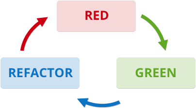
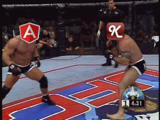

Tuleap.hipster.io.js: MV* frameworks investigations
===================================================

Some users have experienced performances issues when using the Tuleap AgileDashboard with a huge set of data. We decided to have a spike on how a MV* framework could help. Before we started, we set ourselves a few specific aims:
    
* Advanced manipulations (drag'n'drop, filtering...) would not be affected by having a lot of data on the same page.
* This could be done with well structured code and produce good results with only a few lines.

Candidates
----------
- [Knockout](http://Knockoutjs.com/) [MIT]: a small data-binding framework
- [AngularJS](https://angularjs.org/) [MIT]: one of the biggest MVW framework on the market
- [VanillaJS](http://vanilla-js.com/): the good ol' way to write JavaScript

Data-binding for dummies
------------------------
Frameworks which allow data-binding provide a strong connexion between the model and the view. When the model is modified, the view seemlessly handles these modifications and vice versa. Such JavaScript frameworks allow to have both the model and the view on the front-end side. We can then implement an observer which will notify the backend when the model is modified.
    
More details: [AngularJS documentation](https://docs.angularjs.org/guide/databinding).

Knockout
--------
Knockout is a very light JavaScript framework. It only handles two-way data binding. If we wanted to add new features, we would have to use an external library. For example, we had to use jQuery to handle REST calls. We also had to implement a little algorithm to manage list filtering.

Thanks to this [great tutorial](http://learn.Knockoutjs.com/#/?tutorial=intro), it was easy to master the framework and [implement new features](http://Knockoutjs.com/documentation/custom-bindings.html).
    
**The good:**
   
* Well-documented, didn't encounter difficulties creating features which may seem complex at the first sight
* Few constraints when structuring the app
   
**The meh:**
  
* We had to pull dependencies for some basic features (ajax), or implement them ourselves (filtering)
* Small online community

AngularJS
---------
AngularJS is a complete JavaScript framework. The main idea is, like Knockout, data-binding but it also provides routing, components, filtering, testing... It takes a little time to understand all the mechanics but it's very powerful.

As a **framework**, AngularJS brought us the required structure and workflow to get things done. And as red-green-refactor aficionados, we really did like the dependency injection that has been put everywhere in the stack.

**The good:**

* We found many resources on the Internet like the (very nice) AngularJS documentation which helped us to in our spike.
* Everything is handled by Angular, not only the data-binding
* Testing framework included

**The meh:**

* It takes a little time to master all the *basics*

VanillaJS
---------
Coding without knowing the framework's best practices, we faced performance issues (drag'n'drop, scrolling...). We knew we could fix them by writing our frameworks, but it forced us to ask this question: **why not code everything by ourselves (again)?** We would have needed to rewrite all the data-binding architecture, to use external libraries etc.

We didn't go any further because the cost would be way too expensive and we don't like reinventing the wheel.

And the winner is...
--------------------
First of all, let's keep in mind we need to compare apples with apples and pears with pears, i.e. AngularJS should be compared to Knockout + jQuery + a routing lib + a ajax lib...

We thought that Knockout was a great framework with great documentation, easy to learn and extend. But... **AngularJS is the winner** because:

* It's more consistent because you have all the features you'll need out of the box.
* It's not heavier than Knockout
* It forces us to be more structured in our JavaScript development so, by following the docuentation and applying its recommended practices, we know we will be doing things the "right way"".
* It has also a bigger community, more people talk about it on the Internet. We think it's a better choice for an open source project; more people are familiar with AngularJS so it's easier to encourage contributions than with Knockout. Here are Google trends between the two frameworks:

Stay tuned!
-----------
We'll write articles about our AngularJS experience in the *real world*. My little finger has just told me that we there is a brand-new Tuleap service that is currently being developped with AngularJS :) 

